# Project 2 — EC2 Instance with Remote Desktop Access and CloudWatch Monitoring

## Overview
Launched a free-tier EC2 instance on AWS, configured a security group to allow Remote Desktop Protocol (RDP) access, connected to the Linux instance from a local Windows machine, and set up a CloudWatch CPU alarm with SNS email notifications.

**Live environment:** Running in AWS us-east-1 (N. Virginia)

## AWS Services Used
- **Amazon EC2** — Virtual server (t2.micro, Amazon Linux 2023)
- **Security Groups** — Virtual firewall controlling inbound RDP access
- **Key Pairs** — RSA key pair for secure instance authentication
- **Amazon CloudWatch** — CPU utilization monitoring and alarm
- **Amazon SNS** — Email notification delivery for alarm triggers

## What I Built
- Launched t2.micro EC2 instance (free tier) running Amazon Linux 2023
- Created RSA key pair for secure access authentication
- Configured security group restricting RDP (port 3389) to my IP only
- Connected to cloud instance via Remote Desktop from local Windows machine
- Set up CloudWatch alarm triggering when CPU exceeds 70% for 5 minutes
- Created SNS topic delivering email alerts when alarm fires
- Practiced full instance lifecycle: launch, connect, stop, start, terminate

## Architecture
```
Local Windows Machine
        |
        | RDP Port 3389
        |
Security Group (my IP only)
        |
EC2 Instance (Amazon Linux 2023 - t2.micro)
        |
CloudWatch (CPUUtilization metric)
        |
SNS Topic → Email Alert
```

## Security Configuration
- RDP access restricted to single IP address (My IP only)
- RSA key pair required for password decryption
- No public SSH access enabled
- Security group follows least-privilege principle

## Key Learnings
- How EC2 instances are configured and launched in AWS
- How security groups act as virtual firewalls at the instance level
- How RDP enables remote desktop access to cloud instances
- How CloudWatch monitors EC2 metrics in real time
- How SNS delivers notifications from CloudWatch alarm state changes
- Instance lifecycle management and cost implications of running vs stopped state

## Cost
$0.00 — t2.micro within AWS Free Tier (750 hours/month for 12 months)
Instance stopped when not in use to preserve free tier hours.

## Screenshots

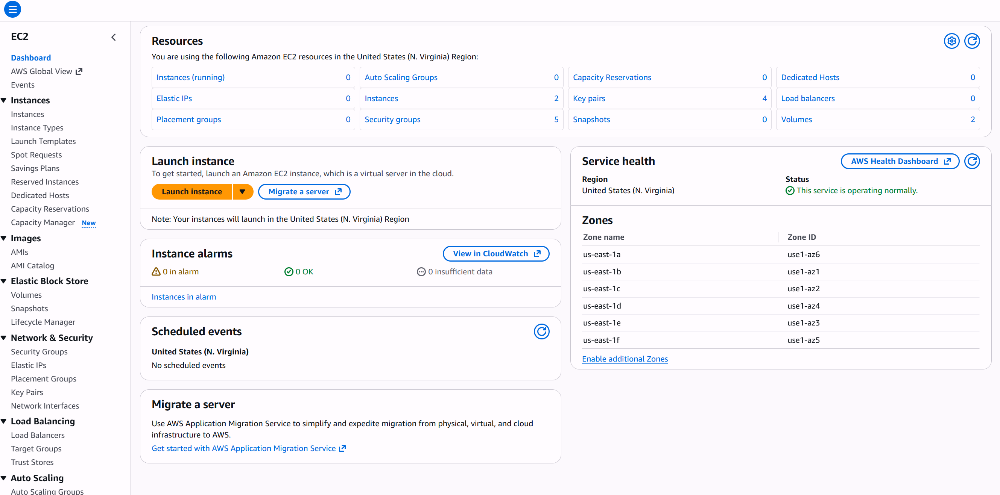
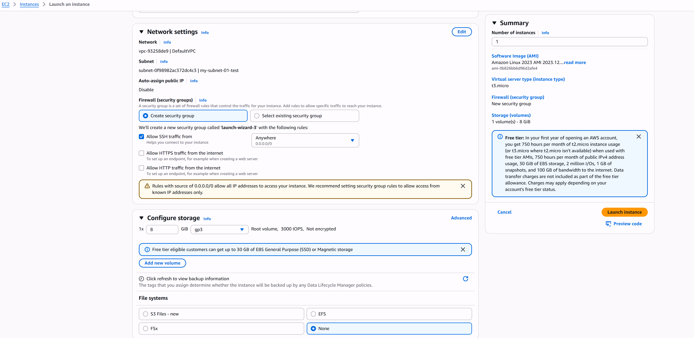
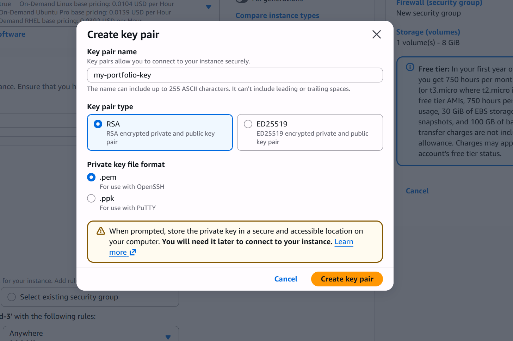
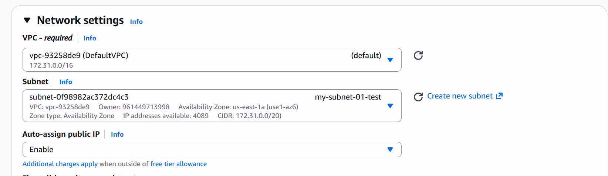
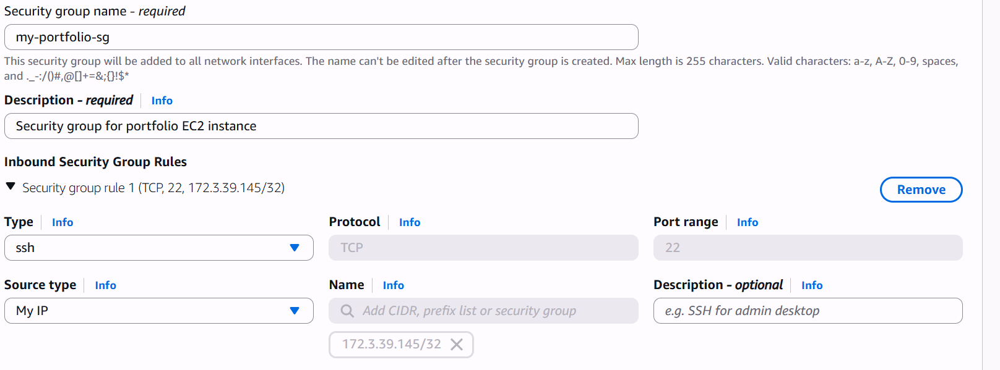
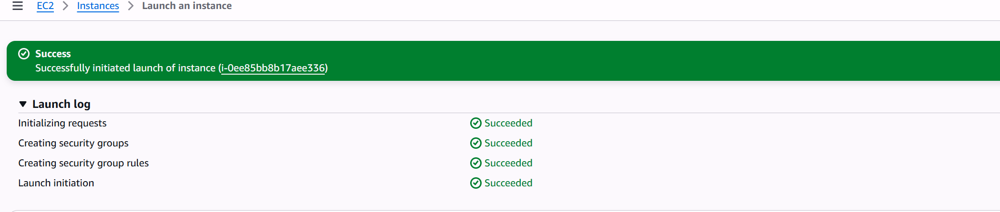
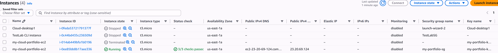
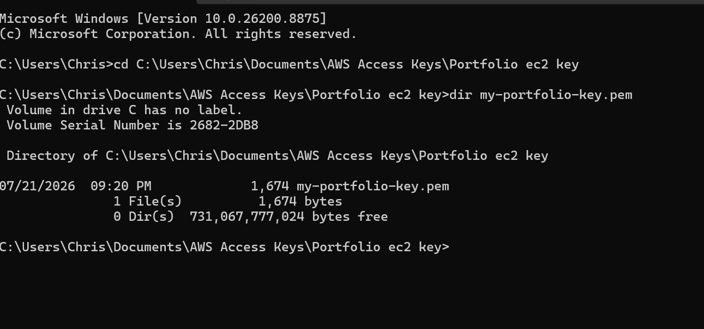
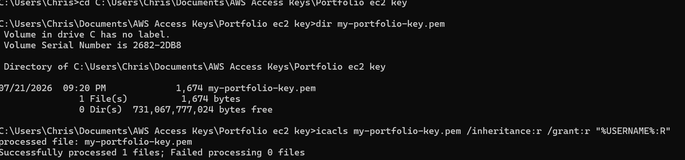
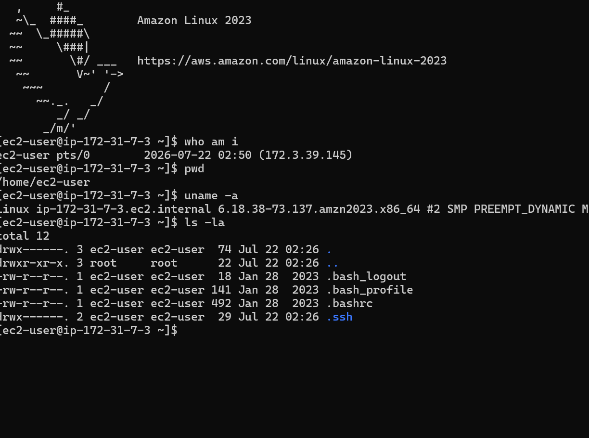
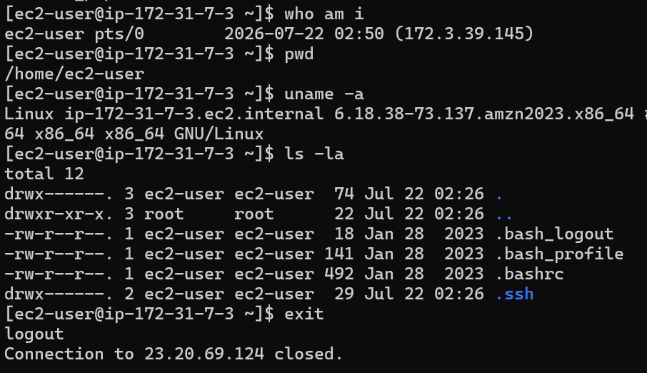
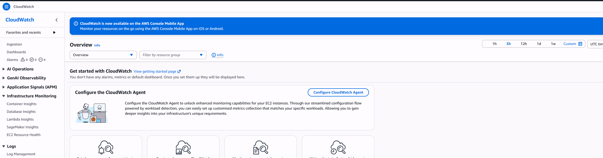


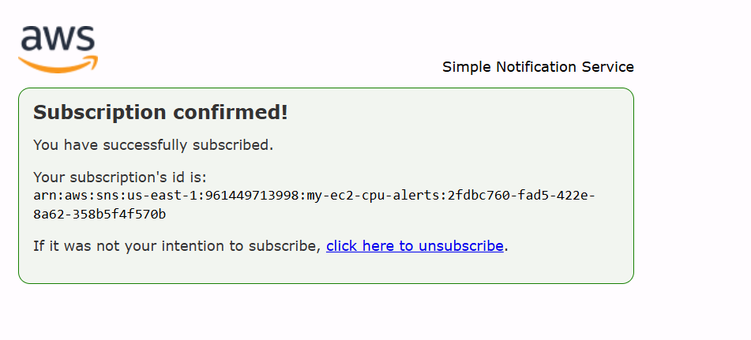
---
*Part of my AWS Cloud Engineering Portfolio | [View all projects](https://github.com/dcprice79)*
